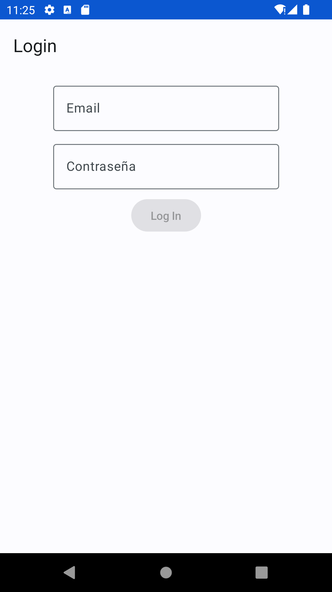
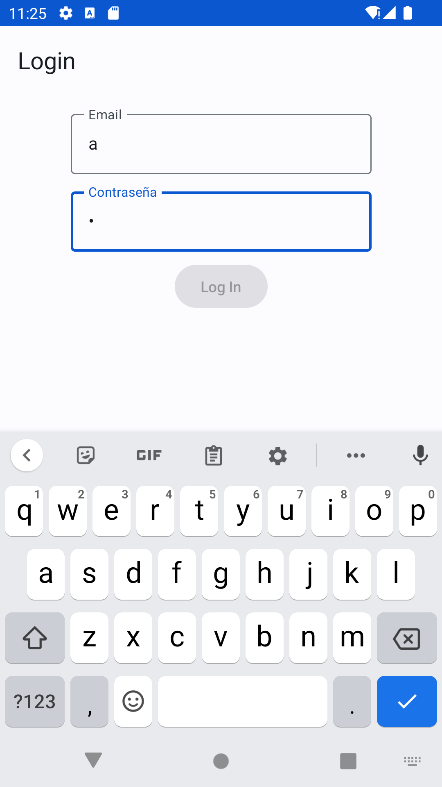
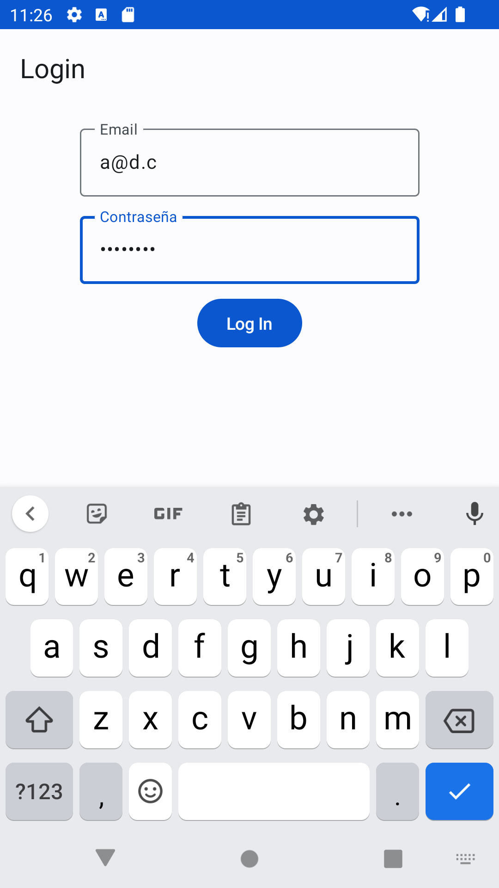
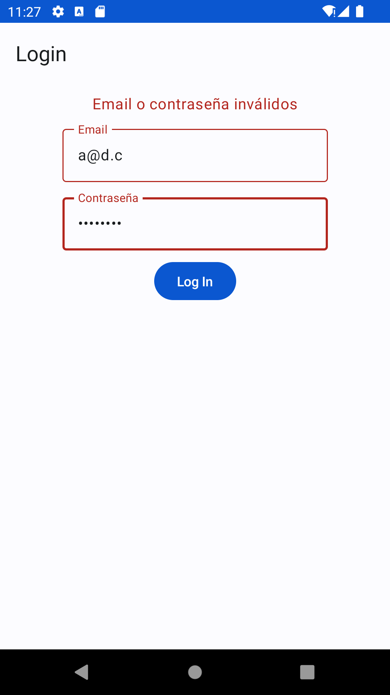
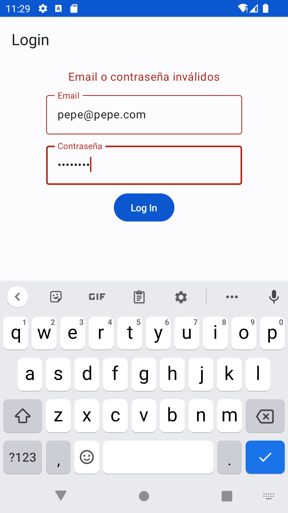
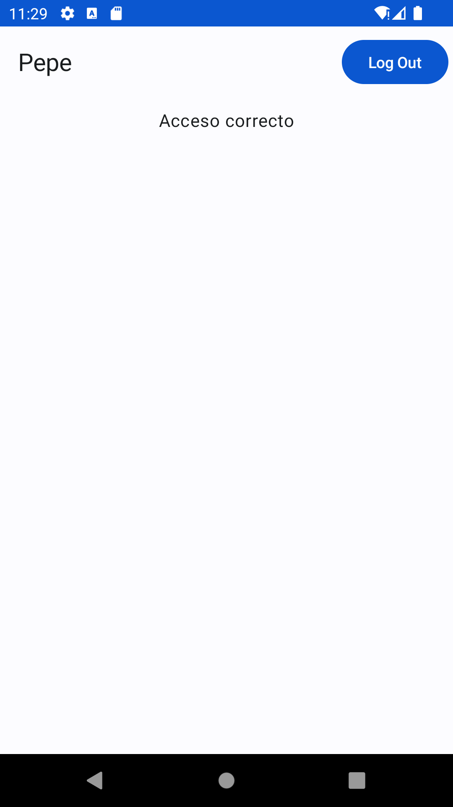

# loginUDF

Login en una única pantalla (sin navegación).

- El botón de Login solo estará activado si se introduce un email y válido y una contraseña de 8 caracteres o más.

- Si las credenciales son correctas (en este caso valdrá con hardcodearlas) se mostrará solo un texto "Acceso correcto" y el título de la TopBar será el nombre de usuario. Además, se mostrará en la TopBar un botón de "Log out".

- Si las credenciales son incorrectas, se mostrará un texto indicando el error encima del formulario de autenticación, y los dos campos de texto mostrarán el error.

